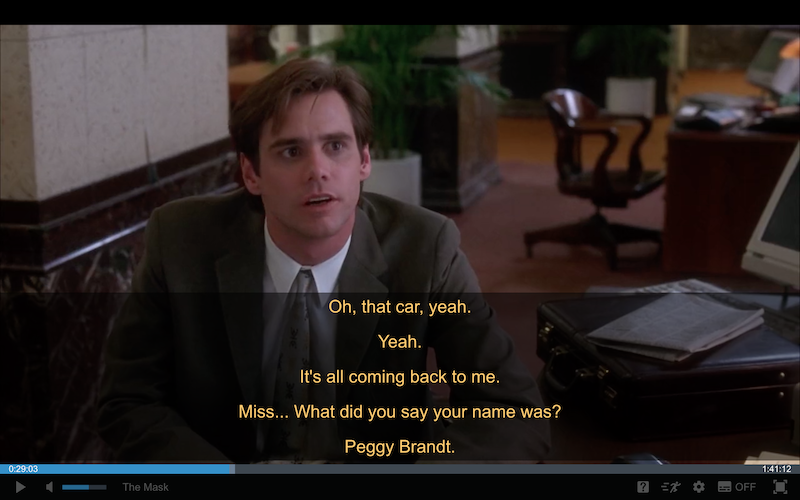

## ORORO.TV Recent Subtitles

Efficient watching movies.

### Learn English by watching movies on ORORO.TV

One of the ways to learn English is watching movies. There are many services to do it,
one of them is [ORORO.TV](https://ororo.tv/ref/1530022), which provides subtitles and
translator allowing to translate unknown words or whole sentences while viewing.

### Recent Subtitles extension

However, depending on the student level, it may be inefficient to read subtitles constantly
not really trying to perceive native speech. At the same time it's important not to lose
the meaning and be in the context every time. There is an option to watch without subtitles
and to do backwards jumps when needed, but it takes extra time.

[ORORO.TV Recent Subtitles](https://chrome.google.com/webstore/detail/ororotv-recent-subtitles/aebfghlgckigccknbckmejjnlaloeeei?hl=en)
extension for Chrome allows watching without subtitles showing recent ones on pause
and making possible just look through them to catch the sense.

### Screenshots

The movie is playing:

The movie is on pause:

By the way, **_Shift+S_** shortcut can be used **_to hide / to show_** subtitles when the movie is on pause.
It may be useful in case when needed to view the frame in details.

## License

MIT
